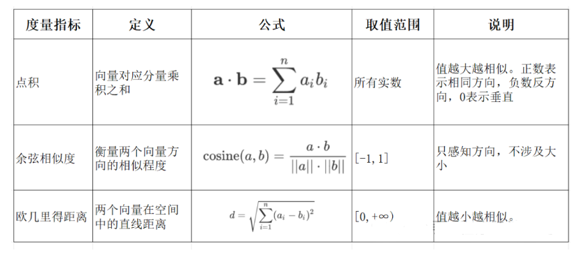

## 1. 向量表征 (Vector Representation)

通过将文本、图像、声音、行为，甚至复杂关系转化为高维向量（Embedding），AI 系统就像是拥有了“数学的眼睛”，可以以数学方式理解和处理现实世界中的复杂信息。

### **本质：万物皆可数学化**

- **降维抽象**：将复杂对象映射到低维稠密向量空间，保留关键语义或特征。就像把一本小说压缩成一本书评，虽简短但保留了核心思想。
- **相似性度量**：向量空间中的距离反映对象之间的语义关联，例如使用余弦相似度。猫和狗的向量距离小于猫和汽车，意味着它们语义上更接近。

### **应用场景**

- NLP：词向量、句向量等
- 推荐系统：将用户行为序列（点击、购买）编码为用户向量，将商品属性编码为物品向量，用于个性化推荐

### **技术实现**

- **有监督 / 无监督学习**：根据任务类型选择合适的训练方式
- **对比学习**：构造正负样本对，拉近正样本向量距离，推远负样本距离，提高模型区分能力

## 2. 向量

向量是具有大小和方向的数学对象。

向量模型是多维的，可以用来描述复杂信息在各个维度上的分布。

### **文本向量**

将文本转化为一组 N 维浮点数（又称 embeddings），可以用来计算语义上的相似度。

### **向量相似度计算方法**

- **点积**：判断两个向量方向是否一致，常用于评估匹配度
- **余弦相似度**：反映两个向量方向的相似程度，就像比较两支箭是否指向相同方向
- **欧氏距离**：计算向量之间的直线距离，类似用尺子量两个点的距离



### 计算方式

以openai为例

安装包

```python
!pip install "numpy<2"
!pip install --upgrade openai
```

测试接口调用模型列表

```python
import os
from openai import OpenAI

os.environ["OPENAI_API_KEY"] = "sk-xxx"
api_key = os.getenv("OPENAI_API_KEY")

client = OpenAI(api_key=api_key)

# ✅ 测试：调用一个简单的接口，比如模型列表
models = client.models.list()
for model in models.data[:5]:  # 只显示前5个模型
    print(model.id)
```

输出

```python
gpt-4-1106-preview
dall-e-3
dall-e-2
gpt-4o-audio-preview-2024-10-01
gpt-4-turbo-preview
```

导入包

```python
import numpy as np
from numpy import dot
from numpy.linalg import norm
```

定义函数公式

```python
def cos_sim(a, b):
    '''余弦距离 -- 越大越相似'''
    return dot(a, b)/(norm(a)*norm(b))

def l2(a, b):
    '''欧氏距离 -- 越小越相似'''
    x = np.asarray(a)-np.asarray(b)
    return norm(x)
```

封装OpenAI模型接口

```python
def get_embeddings(texts, model="text-embedding-3-small", dimensions=None):
    '''封装 OpenAI 的 Embedding 模型接口'''
    if model == "text-embedding-3-small":
        dimensions = None
    if dimensions:
        data = client.embeddings.create(
            input=texts, model=model, dimensions=dimensions).data
    else:
        data = client.embeddings.create(input=texts, model=model).data
    return [x.embedding for x in data]
```

传入文本

```python
test_query = ["我是红领巾"]
vec = get_embeddings(test_query)[0]
print(f"Total dimension: {len(vec)}")
print(f"First 10 elements: {vec[:10]}")
```

输出

```python
Total dimension: 1536
First 10 elements: [-0.007748923730105162, -0.008847244083881378, -0.03521906957030296, 0.044466808438301086, 0.00043993498547933996, -0.03839873895049095, 0.04439399018883705, 0.060777775943279266, -0.05291355773806572, -0.07106921821832657]
```

传入文本

```python
query = "孩子"

# 且能支持跨语言
# query = "global conflicts"

documents = [
    "爸爸",
    "妈妈",
    "爷爷",
    "狗",
    "电钻",
]

query_vec = get_embeddings([query])[0]
doc_vecs = get_embeddings(documents)

print("Query与自己的余弦距离: {:.2f}".format(cos_sim(query_vec, query_vec)))
print("Query与Documents的余弦距离:")
for vec in doc_vecs:
    print(cos_sim(query_vec, vec))

print()

print("Query与自己的欧氏距离: {:.2f}".format(l2(query_vec, query_vec)))
print("Query与Documents的欧氏距离:")
for vec in doc_vecs:
    print(l2(query_vec, vec))
```

输出

```python
Query与自己的余弦距离: 1.00
Query与Documents的余弦距离:
0.4240462223079721
0.4765141292974588
0.3366559995031216
0.43702147899180904
0.2658977836438793

Query与自己的欧氏距离: 0.00
Query与Documents的欧氏距离:
1.0732695756707726
1.023216420333268
1.151819431860251
1.06111125502473
1.211694884130354
```

## 3. 嵌入模型（Embedding Models）

嵌入模型的核心任务是将非结构化数据（如文本、图像）转化为结构化的向量形式。

就像用一个“压缩器”将复杂数据压缩为低维稠密向量，使机器更容易处理。

### **设计要点**

- **多语言支持？** 是否支持跨语言处理能力
- **维度选择？** 理论上维度越高表达能力越强，但也会带来计算成本和维度灾难的问题，应合理权衡

### **主流模型推荐**

- 多语言通用：BGE-M3
- 中文场景：BGE-large-zh-v1.5、M3E
- 商业应用：OpenAI 的强势嵌入模型，如 `text-embedding-3-large`、`text-embedding-ada-002`（即 adav2）

## 4. 向量数据库（Vector Databases）

向量数据库用于存储、管理和检索向量数据，核心功能包括向量存储、相似度度量与相似性搜索。

### **向量数据库 vs 传统数据库**

| 特性     | 传统数据库           | 向量数据库                     |
| -------- | -------------------- | ------------------------------ |
| 数据类型 | 结构化（表格、字段） | 非结构化（向量）               |
| 查询方式 | 精确匹配             | 相似匹配（模糊语义检索）       |
| 使用场景 | 电商订单、财务数据等 | 搜索引擎、推荐系统、知识问答等 |

📌 **注意**：向量数据库不负责生成向量，嵌入向量是由 embedding 模型产生的。

### **主流向量数据库推荐**

- **Milvus**：适用于大规模、高并发、分布式部署场景
- **Chroma**：适合企业内部构建知识库或轻量型应用

## N.推荐文章

[https://www.sbert.net](https://www.sbert.net)

[https://huggingface.co/spaces/mteb/leaderboard](https://huggingface.co/spaces/mteb/leaderboard)
