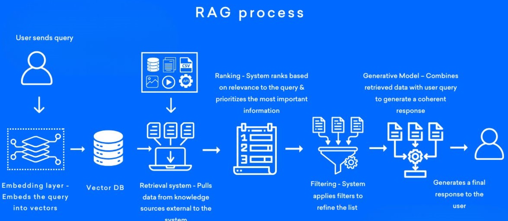
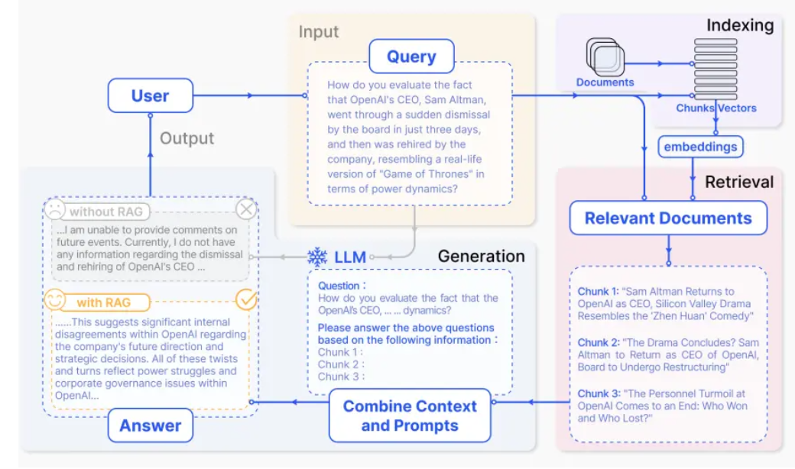

## 1. 应用开发

在使用大语言模型进行应用开发时，模型偶尔会生成错误的回答（即产生“幻觉”）。

常见的解决方案包括：

1. **Prompt 编写不当**：设计更具引导性和明确性的提示词可以有效减少模型误判。
2. **缺乏背景知识**：模型并非实时联网，缺乏最新或领域特定的信息，此时可采用 RAG（Retrieval-Augmented Generation）方法补充外部知识。
3. **模型能力不足**：针对特定任务，预训练模型可能无法胜任，此时可通过微调增强其能力。

------

## 2. RAG（检索增强生成）

### 定义

RAG（Retrieval-Augmented Generation，检索增强生成）是一种结合了信息检索与文本生成的技术框架。它通过实时检索与用户查询相关的外部知识文档，并将检索结果作为上下文输入给生成模型，以提升生成内容的准确性、时效性与可解释性。

简而言之，RAG 就像是在问答过程中“实时联网”，为生成提供参考依据。

### 优势

- **提升时效性**：模型可接入最新的信息源，避免知识陈旧。
- **减少幻觉**：提供事实支持，减少模型“编造”信息的风险。
- **提升专业性**：在垂直领域表现更优，特别适用于法律、医学、金融等专业知识密集型任务。
- **支持溯源与可解释性**：每个回答均可追溯其依据，有助于建立信任。

### RAG 流程概览

#### 检索与生成流程

1. **Query 向量化**：将用户查询转化为文本向量。
2. **初步检索**：在向量数据库中查找相似的文本片段。
3. **重排序（Re-rank）**：使用更复杂的相关性模型对检索结果进行排序，通常取前 Top-k（如 10 个）。
4. **筛选文档**：根据得分保留质量高的文档片段。
5. **生成回答**：将筛选结果作为上下文传入生成模型，生成最终答案。

#### 构建索引阶段（数据准备）

此阶段通常在系统初始化时完成，可定期增量更新。

- **数据准备**：收集、清洗并整理外部知识数据。
- **文本切分**：将长文档切分为语义连贯的“chunk”（片段），平衡信息完整性与检索粒度。
- **向量化**：使用嵌入模型（如 BGE、text-embedding-3 等）将每个片段转为向量，存入向量数据库（如 FAISS、Milvus）。

#### 检索阶段

- **查询处理**：将用户问题向量化，并在数据库中执行相似度检索。
- **重排序**：利用基于交叉编码器的排序模型，提升结果相关性和精准度。

#### 生成阶段

- **上下文拼接**：将检索到的片段与原始问题组织成完整的上下文（即新的 Prompt）。
- **文本生成**：由大语言模型生成回答，输出给用户。

> 📌 注意：RAG 实际上重构了一个更具上下文支持的 Prompt，通过检索增强模型的推理基础。

## 3.NativeRAG

客户的query会从indexing(向量数据库)进行检索, 检索的文档会加上上下文中. llm会基于新上下文进行生成

## 4.搭建RAG

零代码: Dify, Coze

部署: LangChain, LlamaIndex

