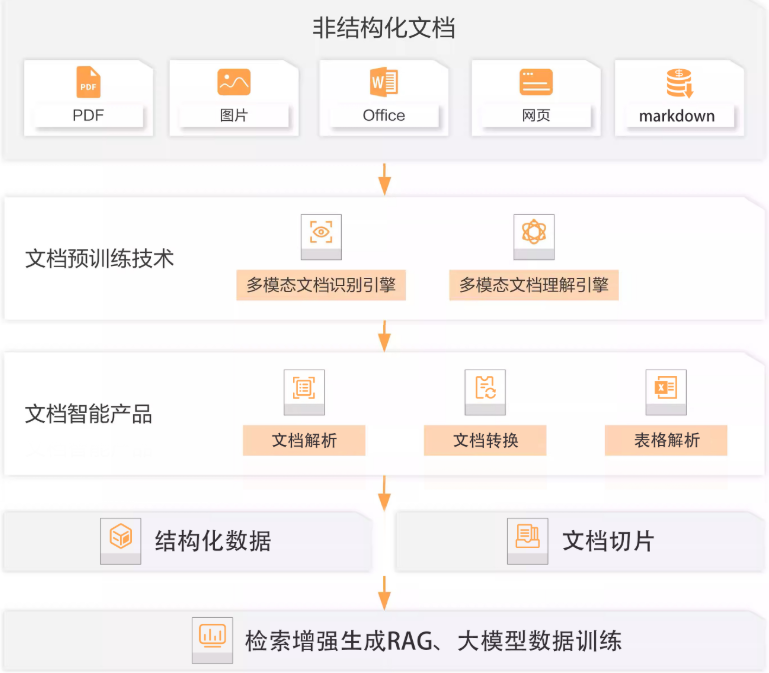

## 1. 数据准备阶段

在基于文档的 LLM 应用中，数据准备往往是影响最终效果的关键环节。本节将探讨数据准备过程中常见的问题，并介绍构建完整数据流程的建议方案。

### 常见问题

1. **数据质量低**：非结构化文档（如 PDF、网页快照）可能包含大量敏感、过时、冗余或矛盾的信息，甚至存在事实性错误，直接用于训练或问答可能导致模型输出不可靠内容。
2. **多模态信息处理困难**：PDF 文档常包含图片、配色、表格等复杂元素，仅提取文本可能无法还原其语义结构，影响后续的信息抽取和理解。
3. **PDF 抽取复杂**：PDF 本质上是为人类视觉阅读设计的格式，不具备明确的逻辑结构，文本内容可能存在顺序错乱、嵌套排版、字体噪声等问题，造成提取困难。

### 构建完整的数据处理流程

为了确保文档数据可用于下游的向量化、索引和推理任务，推荐以下处理流程：

1. **数据审计与分类**：由数据质量团队对原始数据进行检查与归类，识别敏感信息、无效内容，并进行适当处理（如脱敏或剔除）。
2. **数据清洗与去重**：统一文本格式，去除冗余内容，更新过时数据，提升整体数据一致性。
3. **结构化与标注**：对关键内容进行结构化标注，例如标题识别、段落切分、表格转换，必要时进行人工或半自动标注，以便后续用于监督学习或搜索增强生成（RAG）场景。

### 智能文档技术推荐

目前尚无“完美”的 100% 文档解析解决方案，但以下技术可用于提升非结构化文档的处理能力：

- **阿里智能文档技术**：支持将 PDF 转换为结构化的 Doc Tree 表示，适用于表格和图文混排的复杂文档。
- **微软 LayoutLMv3**：基于 Transformer 的多模态文档理解模型，融合文本、布局和视觉特征，适合文档分类、信息抽取等任务。
- **开源工具（如 docTR、PDFPlumber、Unstructured 等）**：提供 OCR、版面分析、内容提取等能力，可根据业务场景灵活组合。
- **Ragflow**：一种面向 RAG 流程的文档处理框架，底层集成 OCR 能力，可将图像型 PDF 转换为可索引的纯文本格式。

> ✅ 建议：在实际项目中，结合业务目标、文档类型和资源成本，采用“规则 + 模型 + 人工校验”相结合的方式，才能取得较好的数据质量和处理效率。

## 2. 知识检索

在构建基于 RAG（Retrieval-Augmented Generation）的问答系统时，知识检索环节是确保生成答案准确性的关键步骤。本节将梳理常见问题，并介绍优化查询与检索效果的实用策略。

### 常见问题(召回率)

1. **查询缺失关键信息**：用户输入可能语义不完整或过于简略，导致检索系统无法覆盖所需的文档内容。例如切片粒度过细会使关键内容分散在多个段落中，降低召回率。
2. **文档排序失真**：系统检索返回的文档中，高相关度文档可能排名靠后，导致重要信息被遗漏，影响最终回答质量。
3. **上下文构建不足**：即使答案存在于数据库中，若该文档未被选入生成时的上下文窗口（例如前 K 篇），模型也无法引用该信息作答。

### 查询改写策略（Query Rewriting）

为了提升召回的精准度和覆盖度，需在检索前对原始查询进行语义增强和结构优化：

- **意图识别与语义补全**：对用户查询进行意图分析，补充省略信息或歧义内容，构建更完整的查询表达。

- **多查询扩展**：使用 NLP 技术将一个模糊查询扩展为多个相似但语义互补的查询，以提升召回覆盖率。

  推荐工具：

  - **LangChain** 的 `MultiQueryRetriever`：使用 LLM 生成多个改写版本的查询，执行并合并检索结果。
  - **LlamaIndex** 的 `QueryFusionRetriever`：支持多个查询结果的融合与去重，提高检索的准确性和稳定性。

### 混合检索与重排策略

采用混合检索（Hybrid Retrieval）结合重排（Re-ranking）是提升检索质量的有效做法：

1. **混合检索（Hybrid Retrieval）**：
   - 使用 BM25 等传统关键词索引方法检索 Top-K（如 10 篇）文档。
   - 同时用语义嵌入模型（如 Cohere、OpenAI Embedding）检索另一个 Top-K。
   - 合并结果去重后形成候选集。
2. **结果重排（Re-ranking）**：
   - 使用跨文档重排模型（如 Cohere Rerank、ColBERT、BGE-Reranker）对候选文档进行打分排序。
   - 保留排名前 N 篇文档（如 Top-5），用于构建生成式模型的上下文窗口。

> 📌 提示：合理控制每个文档的切片长度（如每段 300~500 字），并保持语义完整，有助于避免“内容碎片化”导致的召回失效问题。

## 3. 答案生成

在基于 RAG 的问答系统中，即使检索返回的上下文是正确的，LLM 生成的答案仍可能存在诸多问题。本节将梳理常见问题，并提出针对性的优化手段。

### 常见问题

1. **答案未准确提取重点信息**：
    模型虽然读取了相关上下文，但未能正确识别其中的关键专业知识，往往出现在上下文冗余、语义冲突或噪声干扰较多时。此类问题可通过对模型进行 RAG 场景下的 SFT（监督微调）来缓解。
2. **信息不完整或格式错误**：
    即便上下文覆盖了正确内容，模型输出仍可能遗漏关键点，导致答复不完整；此外，当 Prompt 中指令格式不规范时，模型可能误解任务要求，从而产生格式错误或语义偏差。
3. **幻觉现象**：
    模型生成与事实不符的内容，即“幻觉”，是大模型回答中普遍存在的风险，尤其当上下文不足或提示词模糊时更易发生。

------

### 提升答案生成质量的策略

#### 1. 提示词优化（Prompt Engineering）

可以借助 `DeepSeek-R1` 或 `QwQ`（Qwen 团队推出的推理强化模型）中的“思维链”（Chain-of-Thought）能力，对提示词进行精细化设计：

- **信息提取**：从用户查询中提取核心实体和意图。

- **需求分析**：识别用户的底层需求，例如是要“列出步骤”还是“提供定义”。

- **提示词重写**：根据语境将原始 Query 转化为更明确、有格式要求的 Prompt，例如：

  > 将“如何开卡”转化为：“请按步骤说明用户在线开通 XX 银行信用卡的流程，包括登录、资料填写与激活。”

#### 2. 引入动态防护栏（Dynamic Guardrails）

动态防护栏是一种实时监控并干预生成内容的机制，结合规则系统和 Agent 框架，可大幅提升输出的可靠性与安全性：

- **机制设计**：
  - 通过工作流（workflow）控制流程；
  - 利用 Agent 决策是否接受或拒绝模型输出；
  - 设置兜底机制：若连续 3 次生成失败或内容不达标，自动触发重新检索。
- **事实性校验**：
  - 在生成后阶段引入校验规则，确保回答内容与检索文档一致；
  - 例如，通过引用验证机制比对输出是否来自具体片段，避免信息编造。

------

### 如何实现事实性校验（后置处理）

在业务逻辑明确的场景下，可以引入规则驱动的“后置处理”步骤，对生成内容进行校验、补全或格式转换：

- **规则示例**：
  - **实体包含规则**：答案必须包含知识片段中的关键术语（如“利率”、“年费”）。
  - **格式约束规则**：输出必须符合特定结构（如步骤格式、JSON 格式等）。
- **实现手段**：
  - 正则表达式 + 关键词匹配；
  - JSON Schema 校验；
  - 模板比对与重写。

------

## 4. 思考：如果 LLM 支持无限上下文，RAG 还有意义吗？

尽管未来 LLM 可能支持百万级上下文窗口，但 RAG 仍具备关键优势：

1. **计算成本优化**
    LLM 处理长上下文时计算成本指数级上升，尤其在生成阶段显著拖慢响应。而 RAG 可在检索阶段快速定位相关知识，仅用精简上下文生成答案。
2. **知识实时更新能力**
    LLM 的知识截止于训练时间，而 RAG 可以即时查询外部文档或数据库，实现“读写分离”，无需频繁微调模型。
3. **更强的可解释性与审计能力**
    RAG 可追踪答案溯源路径（哪段文档支持了该答案），在法律、金融等需要透明性的场景中尤为重要。

## References

阿里文档智能：[https://www.aliyun.com/product/ai/docmind?spm=a2c4g.11174283.0.0.bfe667a8tIVMdG](https://www.aliyun.com/product/ai/docmind?spm=a2c4g.11174283.0.0.bfe667a8tIVMdG)

微软 LayoutLMv3：[https://www.microsoft.com/en-us/research/articles/layoutlmv3/](https://www.microsoft.com/en-us/research/articles/layoutlmv3/)
