## 1.下载ubuntu 22.04.05镜像

可以下官网的 [https://ubuntu.com/](https://ubuntu.com/)

也可以下清华源 [https://mirror.tuna.tsinghua.edu.cn/ubuntu-releases/22.04.5/](https://mirror.tuna.tsinghua.edu.cn/ubuntu-releases/22.04.5/)

## 2.下载rufus

[https://rufus.ie/zh/](https://rufus.ie/zh/)

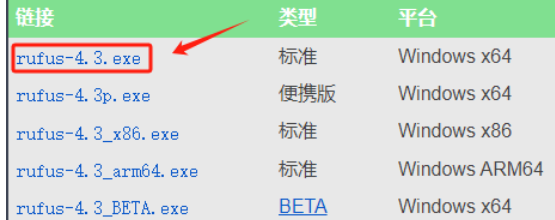

## 3.制作Ubuntu系统启动盘

准备8G或16G U盘, ubuntu 4G左右.

将U盘插入电脑, 启动rufus, 选择下载的ubuntu镜像

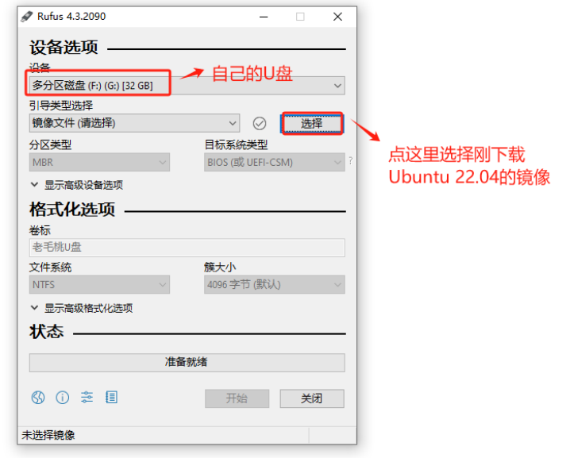

分区类型 + 目标系统类型就选MBR+BIOS或UEFI（我选过GPT+UEFI在grub界面有误）,同时文件系统这个也是选默认FAT32+8192的就行，最后点击开始

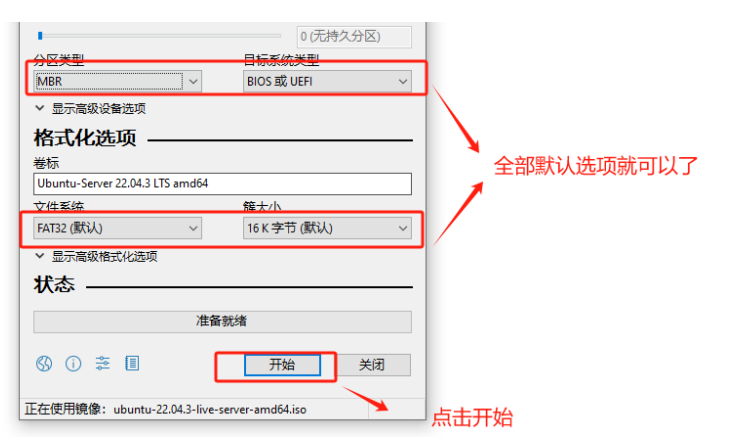

## 4.等待时进行查询和分区

### 查看电脑BIOS 是不是UEFI

"win + r"快捷键进入"运行"，输入"msinfo32"回车

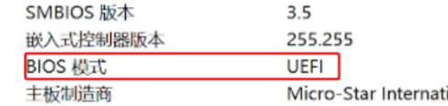

### 磁盘分区

'我的电脑'>邮件'管理'>如果单磁盘, 将最后一个盘进行右键>'压缩卷'

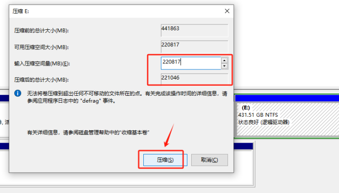

## 5.关闭Windows快速启动

'电源'>'更改不可用设置'>'取消勾选快速启动'

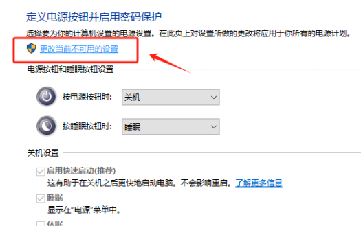

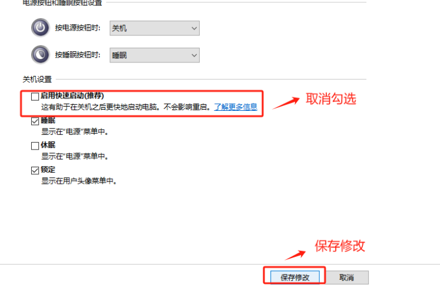

## 6.安装双系统

rufus处理100%成功后, 重启电脑, 进入 'BIOS'

BIOS的进入方法是屏幕快速亮起时, 快速按 F2或者DEL, 如果不是这两个键, 可以查一下电脑对应型号如何进入BIOS

不同电脑的BIOS也不同, 主要要做的是

### 1.关闭Secure boot

如果有disable就disable, 如果没有就在自定义情况下, 选择'其他OS', 并删除第一行的key.

### 2.关闭快速启动

### 3.将USB启动调到第一项

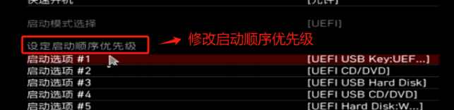

## 7.安装Ubuntu

保存重启后, 应该会到引导页, 选择 Try on Install Ubuntu

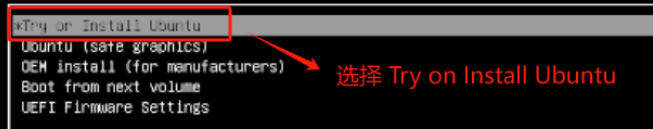

### 如果安装黑屏或卡顿

如果是英伟达显卡, 可能进去会黑屏或者卡顿. 多次重启和改BIOS也不会好

原因: [https://www.bilibili.com/video/BV1wY411p7mU?spm_id_from=333.788.recommend_more_video.-1&vd_source=7da6510c22a89a1b741d11e145115f99](https://www.bilibili.com/video/BV1wY411p7mU?spm_id_from=333.788.recommend_more_video.-1&vd_source=7da6510c22a89a1b741d11e145115f99)

那么可以参考[https://www.bilibili.com/video/BV1wY411p7mU?spm_id_from=333.788.videopod.episodes&vd_source=7da6510c22a89a1b741d11e145115f99&p=3](https://www.bilibili.com/video/BV1wY411p7mU?spm_id_from=333.788.videopod.episodes&vd_source=7da6510c22a89a1b741d11e145115f99&p=3)

第二次到安装Ubuntu的这个页面, 按'e'

将'---'去掉, 换nomodeset, 再按F10可以进入安装

## 8.安装流程

1.选择语言

English, Install Ubuntu

2.键盘布局

EnglishUS, EnglishUS

3.Wifi

没看到这个选项, 被跳过了

4.安装模式

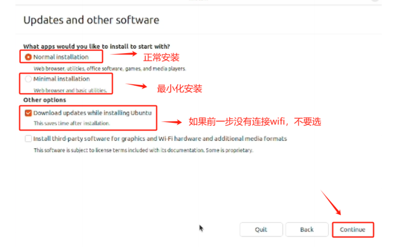

6.分区

我们先前分区是分了215G, 这里分四个区

选中215G的free space, 点击'+'分区

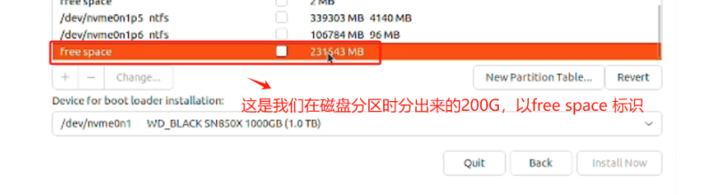

分区1, 启动

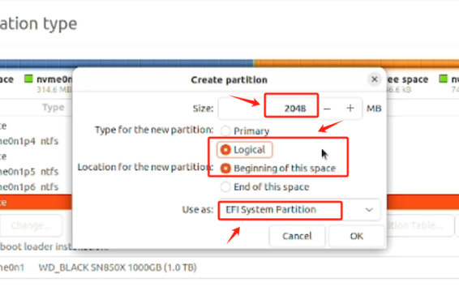

分区2, swap

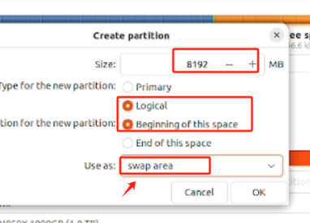

分区3, 主目录

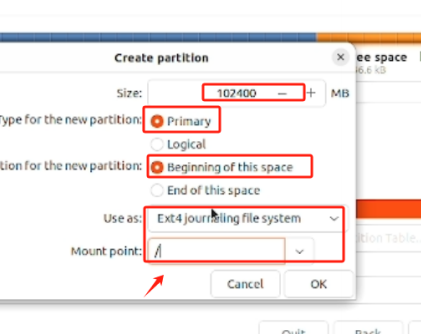

分区4, 其他盘

### 注意, 要选择安装启动项的位置

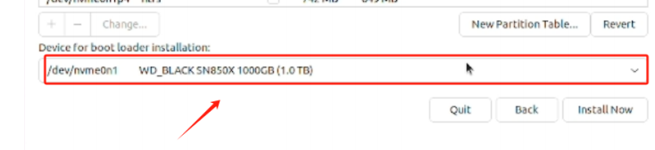

和第一个分区的2G大小要一致!!!

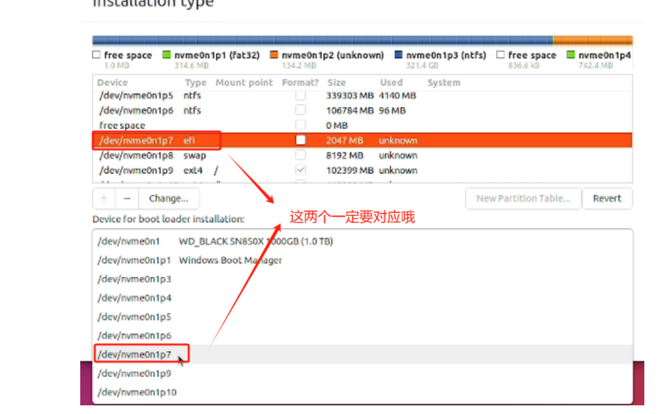

随后一直点就安装了

## 9.重启

安装完成后拔U盘重启

注意, 会进一个Ubuntu加载页面让你拔U盘再按回车, 此时我们直接按回车就行

之后就能看到这个页面

### 如果无法载入Ubuntu

如果此时中间的圈圈不动, 那么就又是先前安装时一样的原因.

此时参考[https://www.bilibili.com/video/BV1wY411p7mU?spm_id_from=333.788.videopod.episodes&vd_source=7da6510c22a89a1b741d11e145115f99&p=4](https://www.bilibili.com/video/BV1wY411p7mU?spm_id_from=333.788.videopod.episodes&vd_source=7da6510c22a89a1b741d11e145115f99&p=4)

在第一项按e, 末端加nomodeset, 按F10. 就可以进去了

注意, 这个设置都是一次性的, 我们需要将nomodeset加入黑名单, 参考那个链接就好. 之后都可以进去了

## References

大量参考赋范空间: [https://kq4b3vgg5b.feishu.cn/wiki/JuJSwfbwmiwvbqkiQ7LcN1N1nhd](https://kq4b3vgg5b.feishu.cn/wiki/JuJSwfbwmiwvbqkiQ7LcN1N1nhd)

黑屏原因: [https://www.bilibili.com/video/BV1wY411p7mU?spm_id_from=333.788.recommend_more_video.-1&vd_source=7da6510c22a89a1b741d11e145115f99](https://www.bilibili.com/video/BV1wY411p7mU?spm_id_from=333.788.recommend_more_video.-1&vd_source=7da6510c22a89a1b741d11e145115f99)

安装时黑屏解决方案: [https://www.bilibili.com/video/BV1wY411p7mU?spm_id_from=333.788.recommend_more_video.-1&vd_source=7da6510c22a89a1b741d11e145115f99](https://www.bilibili.com/video/BV1wY411p7mU?spm_id_from=333.788.recommend_more_video.-1&vd_source=7da6510c22a89a1b741d11e145115f99)

安装好后仍然黑屏解决方案: [https://www.bilibili.com/video/BV1wY411p7mU?spm_id_from=333.788.videopod.episodes&vd_source=7da6510c22a89a1b741d11e145115f99&p=4](https://www.bilibili.com/video/BV1wY411p7mU?spm_id_from=333.788.videopod.episodes&vd_source=7da6510c22a89a1b741d11e145115f99&p=4)
