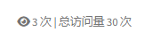

## 1. 使用 Busuanzi 做浏览量统计

一开始我尝试使用 [Busuanzi](https://github.com/Pil0tXia/busuanzi-modified) 统计网站访问量。它是一个轻量级的页面访问计数器，可以通过 HTML 标签快速集成。然而，在使用 Lighthouse 进行性能和安全检测时发现，Busuanzi 会调用一些 Cookie，这在某些场景下可能带来隐私和安全隐患。

因此，我转向了更可控的方案 —— LeanCloud。

## 2. 使用 LeanCloud 自建 PV 统计系统

LeanCloud 提供了一个轻量、易用的数据存储服务，适合前端开发者快速构建访问量统计功能。它支持前端 SDK 集成，也可以通过 REST API 与后端服务对接。

官网：https://www.leancloud.cn/

### 初始化 LeanCloud

1. 登录 LeanCloud 后台，创建一个新的应用；
2. 进入「设置」→「应用 Key」，记录以下三个参数：
   - `appID`
   - `appKey`
   - `REST API Server URL`


### 页面访问量统计脚本

以下是一个完整示例，实现了：

- 当前页面 PV 统计
- 网站总 PV 聚合展示

```
htmlCopyEdit<script src="https://cdn.jsdelivr.net/npm/leancloud-storage@4.15.0/dist/av-min.js"></script>
<script>
  const APP_ID = 'xxxx';
  const APP_KEY = 'xxxx';
  const SERVER_URL = 'xxxx';

  AV.init({ appId: APP_ID, appKey: APP_KEY, serverURLs: SERVER_URL });

  const Counter = AV.Object.extend('Counter');
  const pathname = window.location.pathname;

  // 获取并更新当前页面访问量
  const query = new AV.Query('Counter');
  query.equalTo('path', pathname);
  query.first().then(counter => {
    if (counter) {
      counter.increment('views');
      return counter.save();
    } else {
      const newCounter = new Counter();
      newCounter.set('path', pathname);
      newCounter.set('views', 1);

      const acl = new AV.ACL();
      acl.setPublicReadAccess(true);
      acl.setPublicWriteAccess(true); // 注意：生产环境应仅允许写权限由服务端控制
      newCounter.setACL(acl);

      return newCounter.save();
    }
  }).then(updatedCounter => {
    document.getElementById('leancloud_pv').innerText = updatedCounter.get('views');
  }).catch(console.error);

  // 获取网站总访问量
  const sumQuery = new AV.Query('Counter');
  sumQuery.find().then(results => {
    const total = results.reduce((acc, obj) => acc + (obj.get('views') || 0), 0);
    document.getElementById('leancloud_total').innerText = total;
  }).catch(console.error);
</script>

<i class="fa fa-eye" aria-hidden="true"></i>
<span id="leancloud_pv">-</span> 次 |
<span>总访问量 <span id="leancloud_total">-</span> 次</span>
```

### 注意事项

- 当前脚本允许公开读写 `Counter` 类数据，生产环境建议通过 LeanCloud 云引擎进行访问控制；
- `views` 字段采用累加模式，若需记录独立访客（UV），可参考前文介绍的方法；
- 若页面路径重复或带参数，应进行标准化处理，以免造成统计混乱。

## 3.初始化表

第一次用, 需要创建Counter class, 然后在data 里添加两个column, path String 和 views Number. 默认的就好


## 4.实现效果



## References

busuanzi github: [https://links.jianshu.com/go?to=https%3A%2F%2Fgithub.com%2FPil0tXia%2Fbusuanzi-modified](https://links.jianshu.com/go?to=https%3A%2F%2Fgithub.com%2FPil0tXia%2Fbusuanzi-modified)

LeanCloud: [https://www.leancloud.cn/](https://www.leancloud.cn/)
