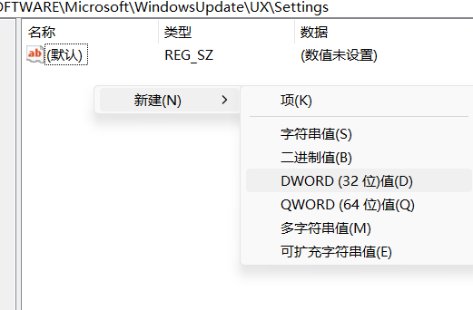
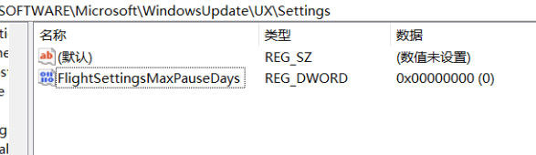
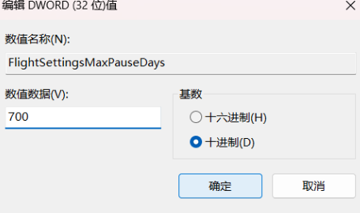

## 1.打开注册表

终端输入`regedit`

## 2.打开相应目录

接着导向以下目录(直接复制到地址栏即可)

`HKEY_LOCAL_MACHINE\SOFTWARE\Microsoft\WindowsUpdate\UX\Settings`

## 3.创建一个32位DWORD

先复制名字再创建, 命名为 `FlightSettingsMaxPauseDays`

## 4.值修改为 7000, 十进制

## 5.在'高级选项>暂停更新'中选择最长的更新日期

成功后结果如下

## 6.参考资料

视频:[https://www.bilibili.com/video/BV18FZbYUEns/?spm_id_from=333.337.search-card.all.click&vd_source=7da6510c22a89a1b741d11e145115f99](https://www.bilibili.com/video/BV18FZbYUEns/?spm_id_from=333.337.search-card.all.click&vd_source=7da6510c22a89a1b741d11e145115f99)

博客:[https://funglearn.top/00820250316-2/](https://funglearn.top/00820250316-2/)
