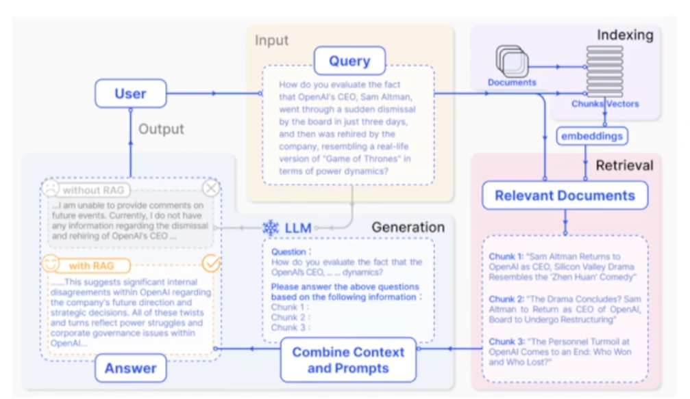
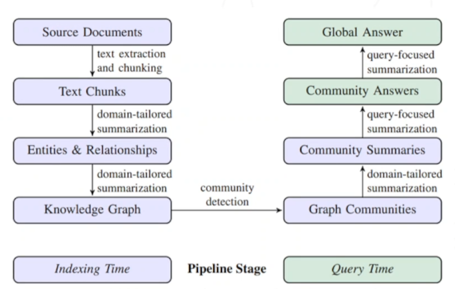

## 1. RAG 基础知识概览

根据索引结构的不同，当前企业落地的 RAG（Retrieval-Augmented Generation）方案大致可分为以下两类：

### 1.1 基于向量索引的语义检索（Semantic Chunking + Vector Retrieval）

以语义切块和向量检索为核心的 RAG 架构是目前最主流的形式，主要代表有：

- **Naive RAG**：将原始语料切分为语义片段，生成向量嵌入后存入向量数据库，支持通过语义相似度进行检索和生成。该方法结构简单，易于实现，适合大多数通用知识问答场景。
  - 参考文献：[Naive RAG (2023)](https://arxiv.org/abs/2312.10997)
- **Advanced RAG**：在 Naive RAG 的基础上引入更丰富的语义增强机制，例如多粒度切块、复杂的上下文窗口策略等，以提升上下文理解能力和生成准确性。

### 1.2 基于图结构的知识建模（Entity/Relation Graph + Graph-based Retrieval）

另一类先进架构是通过实体抽取、关系构图等方式构建知识图谱，结合图检索机制进行增强生成：

- **GraphRAG**：融合实体/关系图谱与图检索，支持基于知识图谱的上下文推理和更强的全局语义关联能力，尤其适用于需要高精度关系建模的企业级应用场景。
  - 参考文献：[GraphRAG (2024)](https://arxiv.org/abs/2404.16130)

## 2. RAG 技术路线与常用工具

### 2.1 Naive RAG 架构

基于语料切块、向量嵌入与检索构建知识库的标准流程：

- 常用工具：**LangChain**、**LlamaIndex**
- 流程：文档预处理 → 分块 → Embedding → 存入向量数据库 → 检索与生成

### 2.2 GraphRAG 架构

基于知识图谱的 RAG 路线，主要强调实体识别、关系抽取与图检索：

- 常用工具：**Microsoft GraphRAG**、**LightRAG**
- 特点：适合领域知识复杂、实体关系密集的场景，如金融、医疗等

### 2.3 一站式 RAG 平台工具

无需从零构建，可直接上手的产品化工具：

- **Dify**：提供可视化工作流和多模型支持
- **RagFlow**：支持从数据接入到评估的一体化流水线构建

------

## 3. 核心知识点详解

### 3.1 索引优化策略

- **文档解析与格式支持**：支持 PDF、HTML、Markdown、PPT、Excel 等多格式解析能力是构建通用知识库的前提。
- **切块策略设计**：
  - 按语义 vs 按结构
  - 固定长度 vs 滑动窗口
- **Embedding 模型选型**：
  - 选择适合文本类型（代码、通用语言、专业术语）的模型
  - OpenAI, Cohere, BGE（中文）等主流模型均应根据实际效果评估
- **向量数据库选型**：
  - 考量维度支持、检索速度、混合检索能力，如 FAISS、Milvus、Weaviate、Qdrant 等

### 3.2 检索优化策略

- **ReRank 引入时机**：当初始检索结果包含语义偏差或排序不符合语义预期时，可使用 CrossEncoder 进行重排序。
- **混合检索策略（Hybrid Search）**：
  - 结合语义检索（向量）与关键词检索（BM25）提升覆盖率
- **延迟优化**：
  - 索引预热、并行检索、向量量化压缩等手段
- **效果评估**：
  - 使用 Precision@k、Recall@k、MMR、BLEU/ROUGE 等指标
  - 可视化工具如 LlamaIndex Dashboard、Weaviate Studio 辅助分析

### 3.3 知识图谱融合策略

- **何时需要知识图谱**：
  - 当需要显式建模实体之间的复杂关系或增强上下文推理能力时
- **结合方式**：
  - 图谱实体作为索引项参与检索
  - 向量检索作为召回，图谱用于重排序与生成增强
- **海量图谱管理**：
  - 建议使用图数据库（如 Neo4j）管理实体关系
  - 引入图压缩与聚类方法提升可扩展性

### 3.4 增量更新与评估指标体系

- **版本控制机制**：
  - 支持多版本索引与模型对比
- **增量更新策略**：
  - 基于时间戳/变更记录进行局部更新，避免全量重建
- **评估指标工具**：
  - **RAGAS**：标准评估指标集合，适用于 pipeline 各环节性能评估
  - **TruLens**：针对生成模型的偏好与一致性分析
  - **自定义指标**：例如领域覆盖率、召回-生成一致性评分等

## References

1.Naive rag [https://arxiv.org/abs/2312.10997](https://arxiv.org/abs/2312.10997)

2.graph rag [https://arxiv.org/abs/2404.16130](https://arxiv.org/abs/2404.16130)

我需要你帮我写一段代码. 我的情况如下: 

我在'D:\GitBlog\_posts\'文件夹里有很多md文件, 命名格式为'2025-03-20-Rag-Essentials-You-Need-to-Know.md',  '2025-03-21-Fundamentals-of-Agent-Theory.md'

我需要这段代码每次执行的时候, 在最新的三篇里检索并改正两个内容: 一个是存放的图片, 一个是时间
