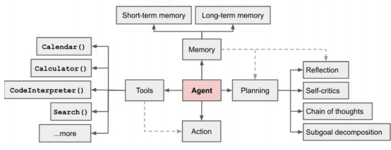

## 1.AI Agent 技术发展史


Agent 技术的演化路径如下：

```
提示工程 → RAG → Function Calling → ReAct → 初代 Agent 框架 → Multi‑Agent → MCP → A2A
```

- **提示工程（Prompt Engineering）**：通过精细设计提示让 LLM 有效完成任务；
- **RAG（Retrieval‑Augmented Generation）**：结合外部检索增强生成模型的知识覆盖；
- **Function Calling**：让模型通过调用函数接口接入工具或 API；
- **ReAct**：将“思考”和“行动”交错融合，提升推理和行动的协同能力；
- **Agent 初代框架**：将 LLM 封装成 Agent，配合 memory、planning、tools 等模块；
- **Multi‑Agent**：通过多个子 Agent 间协作，解决单 Agent 的工具选择和上下文局限；
- **MCP（Model Context Protocol）**：统一 Agent 与工具/数据的交互协议，实现“一次接入，多处复用”；
- **A2A（Agent‑to‑Agent）**：定义 Agent 间通信与协作协议，实现跨平台互操作。

## 2. ReAct：融合“思考（Reasoning）”与“行动（Acting）”

- ReAct 是一种 Prompt 策略，交替生成 `Thought: ...` 与 `Action: ...`，并在每步后得到观测 `Observation:`，形成类似 “思考–行动–观测” 的循环路径 [Lil'Log+1](https://lilianweng.github.io/posts/2023-06-23-agent/?utm_source=chatgpt.com)[ar5iv](https://ar5iv.labs.arxiv.org/html/2503.23278?utm_source=chatgpt.com)。
- 它能：
  - 在复杂推理中主动调用工具（例如维基检索接口），支持动态纠错与计划调整；
  - 在 QA、事实验证、文本游戏、网页导航等任务中表现优于只“思考”或只“行动”的模型 [arXiv](https://arxiv.org/pdf/2210.03629)。
- 实验显示 ReAct 在 HotpotQA 和 FEVER 上提升显著，尤其当与 CoT（Chain‑of‑Thought）结合使用时效果更佳 [arXiv](https://arxiv.org/pdf/2210.03629)。




## 3. Multi-Agent 多智能体协作

- **背景与动因**：
  - 单个 Agent 面临工具使用、上下文长度限制等问题；
  - 多场景下，规划能力较弱，难以灵活路由任务；
- **Multi-Agent 模型**让多个子 Agent 分工协作（如前端 Agent、后端 Agent），协调解决复杂业务逻辑；
- **挑战**包括子 Agent 之间的通信协议、状态一致性、协作调度等；
- 相关研究：
  - Multi‑Agent 框架 1：**（例如论文 arXiv:2308.10848）**
  - Multi‑Agent 框架 2：**（例如论文 arXiv:2308.00352）**

------

## 4. Agent 开发标准化进程：MCP 与 A2A

### MCP：Model Context Protocol

- MCP 是一种标准化接口协议，旨在统一 AI 模型与外部工具和数据源的交互方式；
- 它包括三个角色：**MCP Host、MCP Client、MCP Server**，分别负责接入环境、协议中介、工具与数据提供端；
- 支持工具发现、资源访问、Prompt 模板复用等，并关注安全性、生命周期管理等问题 [ar5iv](https://ar5iv.labs.arxiv.org/html/2503.23278?utm_source=chatgpt.com)。

### A2A：Agent‑to‑Agent 协议

- 面向 Agent 间的通信与协同协议，实现多 Agent 生态系统间的互操作；
- 使 Agent 能在不同平台或系统间传递指令和状态，支持复杂协作流程；
- Google 曾发表相关技术博客，介绍其 Agent 间的协作机制。

------

## 5. Agent 技术路线与支持工具

| 开发级别       | 特征与目标                                           | 主流工具/框架                                                |
| -------------- | ---------------------------------------------------- | ------------------------------------------------------------ |
| **低代码开发** | 可视化编排，快速上线，集成 RAG、工具、评测系统等     | Coze、Dify、n8n                                              |
| **敏捷开发**   | 模块化 Agent、工具、记忆、评测追踪等，适合快速构原型 | LangChain、LlamaIndex、Haystack、AutoGen、CrewAI             |
| **底层开发**   | 自研运行时／协议，最大灵活性，适配复杂场景           | LangGraph、OpenAI Agents SDK / Responses API、Google ADK、Semantic Kernel |

此分类有助于选择技术路径：低成本上手 VS 高度定制与扩展性。

------

## 6. 核心能力与策略建议

1. **Agent 技术全景认知**：
   - 架构基本要素：memory、tools、planning、action；
   - 理解 Function Calling；
   - 掌握主流框架与前沿协议（MCP、A2A）。
2. **框架选型策略**：
   - 根据项目资源和需求选择适合的路径：省时快速 VS 灵活可扩展。
3. **通用场景构建**：
   - 意图识别（Intent）设计；
   - 安全护栏实现；
   - 人机交互（如审批流程）；
   - 性能与成本评估与控制。
4. **大模型项目集成能力**：
   - Agent 与 RAG 如何融合；
   - Agent 与传统业务流程集成；
   - 不同 Agent 框架间的协作与对接。

------

## 7. 常见问题

1. **框架选型：LangGraph、Agents SDK、Google ADK**
   - LangGraph 与 Google ADK 更适合底层深度定制开发；
   - Agents SDK 提供更加完整的底层 + 敏捷支持，具备更多权限与灵活性。
2. **多 Agent 上下文隔离策略**
   - 通常不建议完全隔离上下文；
   - 推荐通过 “state 传递”方式共享必要信息。
3. **流式输出与安全护栏**
   - 可提前让模型输出安全标志；
   - 或者前端做短缓冲，边流边审核，遇触规则立刻停止响应。
4. **Multi-Agent 中的智能路由**
   - 可使用小模型进行意图识别与任务路由。
5. **RAG 的召回与重排行优化**
   - 使用 rerank 模型与后处理策略；
   - 对重复或冗余索引内容进行去重和合并（如增量 merge）。
6. **工具框架学习策略**
   - 深入学习 LangChain 和 LangGraph；
   - Dify、Coze、n8n 可简要了解即可。

## References

1.ReAct [https://lilianweng.github.io/posts/2023-06-23-agent/](https://lilianweng.github.io/posts/2023-06-23-agent/)

2.COT [https://arxiv.org/pdf/2210.03629](https://arxiv.org/pdf/2210.03629)

3.MultiAgent1 https://arxiv.org/pdf/2308.10848

4.MultiAgent2 [https://arxiv.org/pdf/2308.00352](https://arxiv.org/pdf/2308.00352)

5.MCP [https://ar5iv.labs.arxiv.org/html/2503.23278](https://ar5iv.labs.arxiv.org/html/2503.23278)

6.A2A [https://developers.googleblog.com/en/a2a-a-new-era-of-agent-interoperability/](https://developers.googleblog.com/en/a2a-a-new-era-of-agent-interoperability/)
