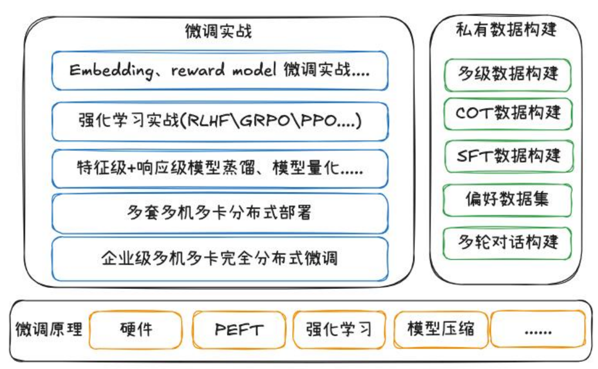

## 1. 微调技术概览

微调（Fine‑Tuning）的目标是让通用或预训练模型在特定任务或业务场景中表现更优。常见的微调模型包括：

- **Embedding 模型**：用于生成任务相关的语义向量表示，支撑检索、排序等下游任务。
- **Reward 模型（奖励模型）**：用于强化学习阶段，为生成模型提供自动化反馈信号。

无论采用哪类模型，**高质量数据是微调成败的核心**。

### 微调流程简要步骤：

1. **模型选择**：
   - 根据任务和资源，选择开源模型或公司私有模型。
   - 优先选择垂类专家模型并进行初步验证，如 SFT、LoRA、QLoRA 或冻结微调。

2. **强化训练**：
   - 在 SFT 基础上，使用强化学习进行增强训练。
   - 构建并训练奖励模型，对输出进行打分反馈，强化正向输出。

3. **性能评估与模型压缩**：
   - 使用标准指标或任务定制指标评估效果。
   - 若部署资源有限，可采用 8-bit 或 4-bit 量化技术压缩模型。

4. **部署上线**：
   - 根据场景选择单机多卡、多机多卡或轻量化模型部署方案。

---

## 2. 微调各阶段关注点

### 2.1 模型选型

- GPU 资源有限：可优先选择 **LoRA** 或更轻量的 **QLoRA（4-bit）**。
- 模型较大或数据量大：考虑横向扩展或分布式训练（DeepSpeed、FSDP 等）。
- 选型依据应结合团队能力、数据情况与业务收益预期。

### 2.2 训练机制与监控

- **关键训练参数**：
  - LoRA 的秩（rank）、冻结层数等需调优。
- **早停机制（Early Stopping）**：
  - 防止过拟合，节省训练资源。
- **Checkpoint 管理**：
  - 建议每轮保存 best_model 及 final_model，便于恢复与评估。
- **全链路监控与回调设计**：
  - 包括 loss 曲线、指标走势、GPU 使用率等。

### 2.3 鲁棒性验证与测试

- **定量评估**：
  - 如困惑度（Perplexity）、BLEU、ROUGE、EM、F1 等。
- **定性评估**：
  - 若无专家，可通过示例输出分析或用户测试进行初评。
- **测试策略**：
  - 场景覆盖测试、压测、分布式推理测试等。

---

## 3. 数据构建与质量控制

高质量训练数据是微调成功的决定性因素。

### 3.1 数据生成流程

1. **程序化生成**：
   - 内容切片 → 构造问答对 → 自动与人工筛选 → 标注校验。
2. **版本管理与数据复用**：
   - 建立数据迭代流程，支持更新与回滚。

### 3.2 数据格式选择

- **SFT（单轮问答）**：适合基础任务。
- **CoT（Chain of Thought）**：适合复杂推理类任务。
- **多轮多级对话**：适合智能助手或任务规划场景。

### 3.3 数据质量流程

- 明确业务需求 → 识别数据类型 → 统一格式与层级。
- 质控流程包括：数据筛选、错误修复、融合与拆分。
- 采用 **随机种子 + 数据种子** 控制实验复现性。

### 3.4 偏好数据构建

- 定义用户偏好任务 → 构建正负样本 → 层级标注。
- 有效区分好与坏样本，有助于提升模型细粒度能力。

### 3.5 针对量化训练的数据设计

- 构造“激活难点”样本以覆盖量化边界场景。
- 确保模型在压缩后仍具鲁棒性与泛化能力。

---

## 4. 企业分布式部署重点

### 4.1 分布式训练方案

- **DeepSpeed ZeRO** 系列：
  - ZeRO‑2 切分优化器状态；
  - ZeRO‑3 切分参数、优化器与梯度，适用于超大模型。
- **切分方式**：
  - 横向切分：每台机器分一部分层；
  - 纵向复制：每台机器运行完整模型副本。

### 4.2 推理部署实践

- 工具推荐：
  - VLLM + Ray：适用于在线推理；
  - DeepSpeed Inference：适用于加速推理，但需谨慎评估稳定性。
- 架构整合：
  - 多服务组件融合，统一管理与版本切换。

---

## 5. 核心策略汇总

### 5.1 成本控制与资源优化

- **LoRA vs 全参数微调**：
  - LoRA 适合资源有限、小模型场景。
- **QLoRA**：
  - 更节省显存，适合大模型低预算训练。
- **训练效率优化**：
  - 使用混合精度、累积梯度、梯度裁剪等手段提升 GPU 利用率。
- **ROI 评估**：
  - 衡量训练成本与上线后收益的比例，避免资源浪费。

### 5.2 数据安全与合规

- **本地化部署**：适合数据敏感场景。
- **数据脱敏与加密**：防止泄露，符合法规。
- **联邦学习**：分布式训练避免集中数据。
- **输出合规**：引入审查模块，过滤不合规内容。

### 5.3 模型部署与运维

- **模型压缩**：蒸馏、小模型训练等，适应端侧部署。
- **版本管理与回滚**：便于快速切换与测试。
- **自动扩缩容**：基于推理负载动态调整资源。
- **性能监控与告警**：构建闭环监控体系，提升稳定性。

### 5.4 效果评估与迭代

- **A/B 测试**：线上对比，验证改进是否显著。
- **持续学习**：结合用户数据更新模型（注意漂移风险）。
- **用户反馈机制**：反馈闭环驱动模型持续优化。
- **业务指标提升量化**：转化率、准确率、满意度等。
