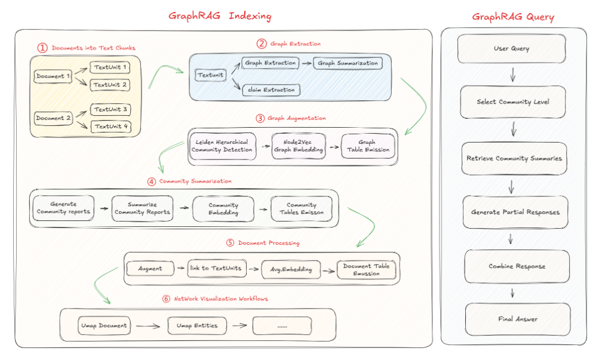
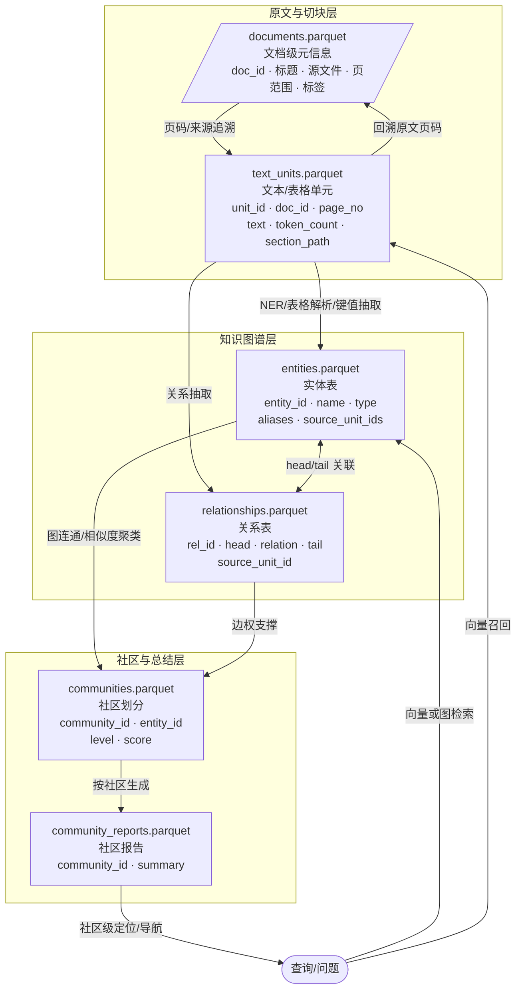

## 0.GraphRag 索引过程

# 1. `documents.parquet`

**作用**：存储原始文档级别的元信息。

**电商示例**：

| doc_id | title                 | source_path     | page_start | page_end | meta_tags               |
| ------ | --------------------- | --------------- | ---------- | -------- | ----------------------- |
| D001   | 2025 智能门锁产品手册 | catalog2025.pdf | 1          | 150      | ["智能门锁","产品手册"] |
| D002   | 2025 充电宝目录       | catalog2025.pdf | 151        | 200      | ["充电宝","目录"]       |

👉 用来追溯 chunk、实体、社区来自哪个 PDF 文件、哪几页。

------

# 2. `text_units.parquet`

**作用**：把 PDF 切分后的 **chunk/句子/表格单元**存储下来，带文档和位置。

**电商示例**：

| unit_id | doc_id | page_no | text                                               | token_count | section_path                   |
| ------- | ------ | ------- | -------------------------------------------------- | ----------- | ------------------------------ |
| U1001   | D001   | 12      | "SL-200 型号支持指纹解锁，电池续航约 12 个月。"    | 24          | "智能门锁 > 指纹系列 > SL-200" |
| U1002   | D001   | 13      | "SL-210 型号增加蓝牙连接功能，兼容手机 App 控制。" | 30          | "智能门锁 > 蓝牙系列 > SL-210" |
| U2001   | D002   | 160     | "PB-100 充电宝容量 20,000mAh，支持 65W 快充。"     | 22          | "充电宝 > 高容量系列 > PB-100" |

👉 GraphRAG 在这一层上做 **实体抽取**。

------

# 3. `entities.parquet`

**作用**：所有识别出的实体，带归一化、别名、来源。

**电商示例**：

| entity_id | name     | type      | aliases                     | source_unit_ids |
| --------- | -------- | --------- | --------------------------- | --------------- |
| E001      | SL-200   | Product   | ["智能门锁 SL200", "SL200"] | [U1001]         |
| E002      | 指纹解锁 | Feature   | ["指纹识别"]                | [U1001]         |
| E003      | 电池续航 | Attribute | ["Battery Life"]            | [U1001]         |
| E004      | 12 个月  | Value     | ["一年"]                    | [U1001]         |

👉 **GraphRAG 的关键资产**，用于建图和社区发现。

------

# 4. `relationships.parquet`

**作用**：实体之间的边（关系），记录来源。

**电商示例**：

| rel_id | head_entity | relation    | tail_entity | source_unit_id |
| ------ | ----------- | ----------- | ----------- | -------------- |
| R001   | SL-200      | has_feature | 指纹解锁    | U1001          |
| R002   | SL-200      | has_attr    | 电池续航    | U1001          |
| R003   | 电池续航    | value       | 12 个月     | U1001          |
| R004   | SL-210      | has_feature | 蓝牙连接    | U1002          |

👉 构成 **知识图谱**：产品 ↔ 功能/属性 ↔ 参数值。

------

# 5. `communities.parquet`

**作用**：图划分结果，表示每个实体属于哪个社区（簇）。

**电商示例**：

| community_id | entity_id | level | score |
| ------------ | --------- | ----- | ----- |
| C01          | SL-200    | 2     | 0.92  |
| C01          | SL-210    | 2     | 0.89  |
| C01          | 指纹解锁  | 2     | 0.75  |
| C01          | 蓝牙连接  | 2     | 0.78  |
| C02          | PB-100    | 2     | 0.94  |
| C02          | 快充      | 2     | 0.83  |

👉 C01 社区 ≈ “智能门锁系列”，
 C02 社区 ≈ “高容量充电宝系列”。

------

# 6. `community_reports.parquet`

**作用**：为每个社区生成的总结（LLM 产物）。

**电商示例**：

| community_id | summary                                                      |
| ------------ | ------------------------------------------------------------ |
| C01          | "智能门锁系列包括 SL-200 和 SL-210。SL-200 提供指纹解锁，电池续航 12 个月；SL-210 增加蓝牙功能，可用手机 App 控制。整体适合家庭用户，强调便利与安全。" |
| C02          | "高容量充电宝系列 PB-100 主打 20,000mAh 大容量和 65W 快充，适合商务和旅行用户。" |

👉 检索时：先找到社区 → 用 summary 帮用户快速定位，再下钻到具体实体/文本。
