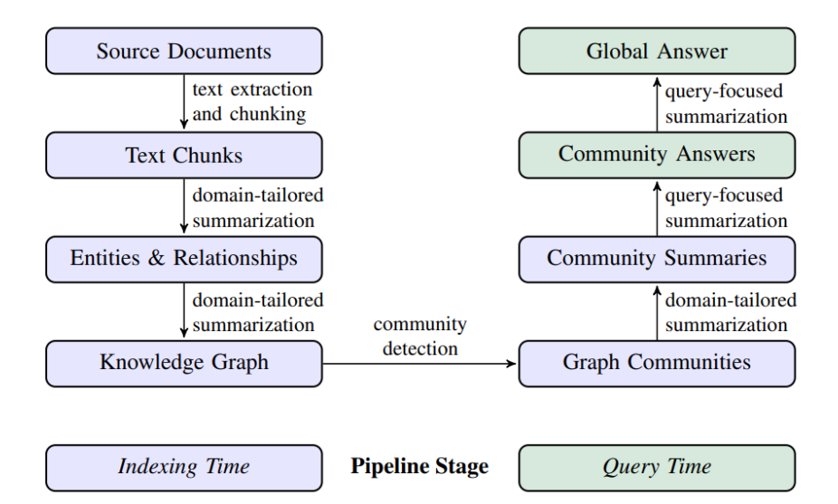
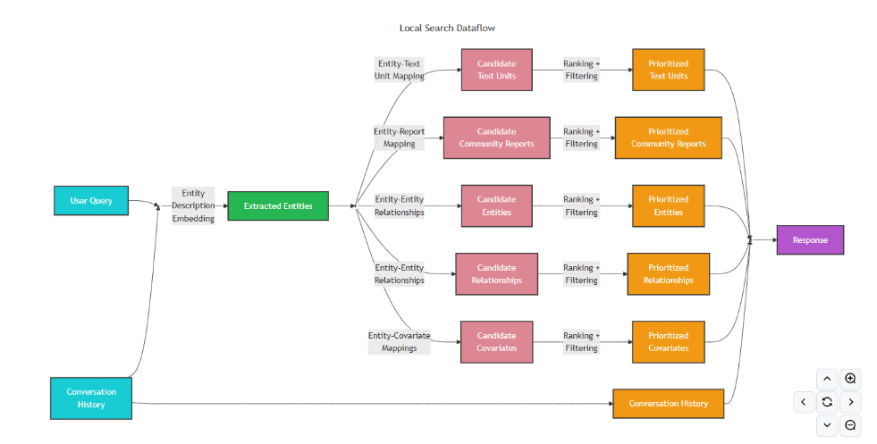

## 1.GraphRAG Indexing & Query 流程

## 2. Query 基本概念

  在索引阶段，我们结合大语言模型与提示工程，从非结构化文本（如 `.txt`、`.csv`）中抽取实体（Entities）和关系（Relationships），构建出基础的知识图谱（Knowledge Graph）。随后，通过分层的 `community` 结构及其 `community_report` 语义，GraphRAG 相较于传统基于 Cypher 的查询方式，能够支持更灵活的 Query 操作。

  `Microsoft GraphRAG` 在开源初期提供了两类查询：`local search` 和 `global search`，分别对应基于实体和基于社区的检索。随着迭代演进，GraphRAG 不仅优化了这两种查询，还新增了 `DRIFT Search` 和 `Multi Index Search`，进一步增强了查询的多样性与效果。

  相较于索引阶段，查询阶段的流程更为直观，核心步骤如下：

1. 接收用户查询请求；
2. 根据查询所需的粒度，选择合适的社区层级；
3. 在对应社区层级中执行检索；
4. 基于社区摘要生成初步响应；
5. 整合多个社区结果，形成最终答案。

  下图来自 GraphRAG 官方论文：https://arxiv.org/pdf/2404.16130

## 3. Search 类别

  GraphRAG 的社区结构是分层构建的。第一层社区（基础社区）创建完成后，会作为节点继续向上聚合，形成更高层级的社区。如此一来，知识图谱可以在不同粒度上组织和表示数据：底层社区包含具体实体与数据，高层社区则提供聚合后的语义概览。

  基于这种分层结构，GraphRAG 提供了两类核心检索管线：

- **Local Search**：基于实体的检索；
- **Global Search**：基于社区摘要的检索。

## 4. Local Search

  **Local Search（本地检索）** 基于实体进行推理和检索。它通常从查询中的相关实体入手，沿着知识图谱中的节点与关系查找相关信息，从而定位最相关的文本片段、摘要与上下文。适合回答 “who”、“what”、“when” 等基于事实的问题。

### 执行流程

1. **加载索引文件**：在 `run_local_search` 的第一阶段，系统依次读取 `text_units.parent`、`entities.parent`、`relationships.parent`、`communities.parent`、`community_reports.parent` 等文件，并加载到内存。

2. **生成向量索引**：在构建索引的最后阶段，执行 `get_embedding`，将实体、关系、内容、社区摘要等数据转为词向量，存储于本地 `LanceDB` 离线索引中。需要注意的是，Local Search 仅对 `entities.parent` 文件的数据生成词向量。

3. **社区层级过滤**：依据 `community_level` 参数过滤实体。例如：

   poetry run poe query --method local --community-level 3 --query "苹果公司都有哪些产品？"

   若实体的 `community_level` 小于等于指定值，则保留，否则丢弃。

4. **实体匹配与上下文构建**：

   - 将输入问题转为词向量，与 `LanceDB` 中的实体向量进行相似度计算；
   - 使用过采样（oversampling）策略提高召回率，过滤 `exclude_entity_names` 列表中的实体；
   - 统计匹配实体所属的社区，并基于“实体引用频次 + 社区重要性排名”进行排序；
   - 进一步提取文本单元、关系及属性，形成完整的数据表格。

5. **生成答案**：将构建好的数据表格填充到 `settings.yaml` 中的 `local_search` 提示词模板，引导大模型生成最终回答。

### 示例

例如，用户提问：

poetry run poe query --method local --community-level 2 --query "乔布斯创办了哪些公司？"

系统会优先检索“乔布斯”相关实体，并通过实体间的关系获取相关社区与报告，最终返回包含公司名称的结果。

## 5. Global Search

  **Global Search（全局检索）** 面向需要整体理解数据集的问题。它依托社区摘要，通过 `map-reduce` 流程汇总和抽象知识图谱中的信息，适合回答诸如“数据集中前 5 个主题是什么”这类全局性问题。

### 执行流程

1. **加载索引文件**：在 `run_global_search` 的第一阶段，系统依次读取 `entities.parent`、`communities.parent`、`community_reports.parent` 文件。
2. **构建实体对象**：加载并格式化各类实体与社区对象。
3. **上下文构建**：选择静态或动态的全局搜索策略：
   - **静态策略**：在预设的社区层级中生成答案。缺点是效率低，且包含与查询无关的报告；
   - **动态策略（dynamic_community_selection）**：从根社区开始，结合提示工程与大模型对社区报告进行相关性评估：
     - 若社区报告相关，则继续遍历其子社区；
     - 若不相关，则“剪枝”该社区及其子社区。
     - 最终，仅相关报告会进入 `map-reduce` 阶段。

### 动态策略的启发式机制

1. **选择性探索**：仅在相关性评分高于阈值时，才进入子社区；
2. **动态队列**：下一轮待评估社区完全取决于上一轮结果；
3. **剪枝机制**：低分社区及其子社区将被丢弃；
4. **自适应性**：不同查询会得到不同遍历路径；
5. **回退策略**：若当前路径无结果，系统会尝试探索其他层级社区。

### 结果生成

动态选择后的上下文会作为 `context_data` 传入 `global_search_reduce_system_prompt.txt`，由大模型生成 `Reduce` 响应。随后，结果再作为 `context_text` 传入 `global_search_knowledge_system_prompt.txt`，生成最终的 `Knowledge` 回答。

## References

`Microsoft GraphRAG` 的官方论文：[https://arxiv.org/pdf/2404.16130](https://arxiv.org/pdf/2404.16130)
