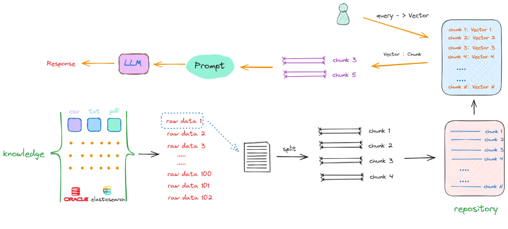
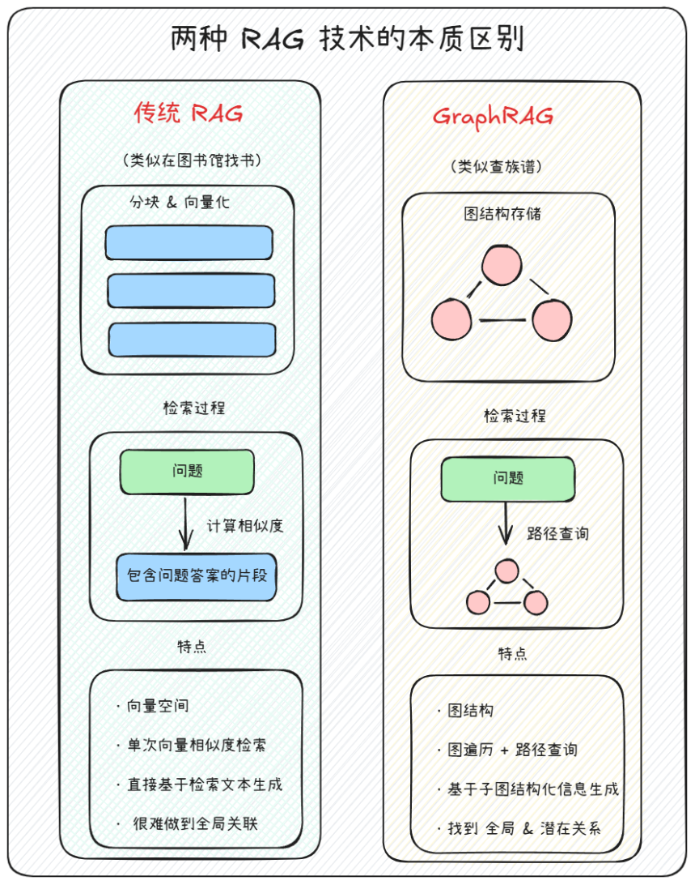
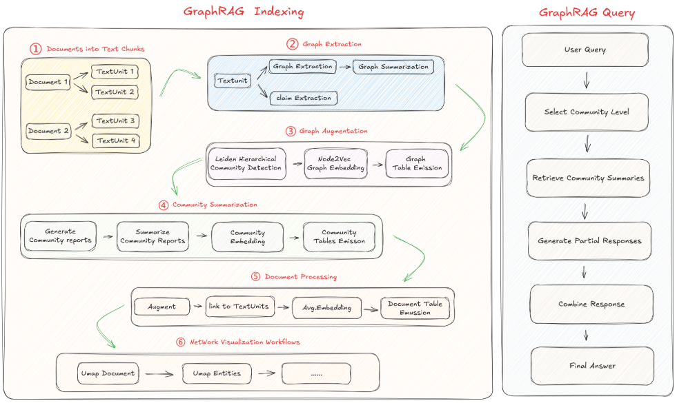

## 1.回顾RAG



RAG分为构建检索阶段和生成阶段.

在构建索引阶段, 我们把结构化的数据转化大模型能识别的向量格式进行存储, 能借助向量数据库高效模糊匹配检索的方式, 非常快速的在庞大的chunk群中检索出最相关的.

在query阶段, 通过用户的问题, 检索出相关的块, 填充prompt最后生成最终的回复.例如让大模型基于检索出来的文本块中的既定事实来回答用户的问题.

## 2.传统RAG VS GraphRAG



对于GraphRAG, 不是吧传统语义且分成一个个小块存储, 而是将实体关系以图的形式进行存储. 变成了要做一个路径的查询. 变成了基于子图的结构化信息进行一个最终的回复.

## 3.常见GraphRAG项目

| 项目名称           | 描述                                                         | GitHub链接                                               | 论文链接                                   |
| ------------------ | ------------------------------------------------------------ | -------------------------------------------------------- | :----------------------------------------- |
| Microsoft GraphRAG | 一个能够将知识图谱和 RAG 结合起来的数据工作流和转换工具，可以提供数据处理，检索问答能力 | [GitHub](https://github.com/microsoft/graphrag)          | [论文](https://arxiv.org/pdf/2404.16130)   |
| LightRAG           | 一个轻量级的RAG框架，支持图增强文本索引、增量更新算法等，比 Microsoft GraphRAG 更适合个人使用，成本相对较低 | [GitHub](https://github.com/HKUDS/LightRAG)              | [论文](https://arxiv.org/abs/2410.05779v1) |
| Fast-GraphRAG      | 更低延迟的GraphRAG实现，动态数据生成和增量更新等，成本约为Microsoft GraphRAG的1/6 | [GitHub](https://github.com/circlemind-ai/fast-graphrag) | -                                          |
| RAGFlow            | 基于深度文档理解构建的开源 RAG（Retrieval-Augmented Generation）引擎 | [GitHub](https://github.com/infiniflow/ragflow)          | -                                          |
| kotaemon           | 集成 GraphRAG 及混合检索等方法的具备本地知识库问答的项目     | [GitHub](https://github.com/Cinnamon/kotaemon)           | -                                          |

## 4.Microsoft GraphRAG介绍

MC GraphRAG [https://github.com/microsoft/graphrag](https://github.com/microsoft/graphrag)



本质:假设我们有一些文本数据，想要将这些数据转换为知识图谱，并且希望图谱能够被大模型所理解，以至于大模型在回答问题时能够利用图谱中的信息进行推理，这个过程就完全可以借助`Microsoft GraphRAG` 工具来实现。因此，我们需要学习和关注的就只有以下两个问题：1.Microsoft GraphRAG 的使用方法；2.如何准备需要检索的文本数据；

安装方式:1.pip 2.源码安装

1.pip

```bash
conda create -name graphrag python=3.11 -y
conda activate graphrag
pip install graphrag
pip show graphrag
graphrag --help
```

- init: 初始化`GraphRAG` 的配置文件；
- index: 构建`GraphRAG` 索引，即`Indexing`过程；
- query: 检索`GraphRAG` 的查询，即`Querying`过程；
- update: 更新`GraphRAG` 的索引，即增量更新；

## References

MC GraphRAG [https://github.com/microsoft/graphrag](https://github.com/microsoft/graphrag)

