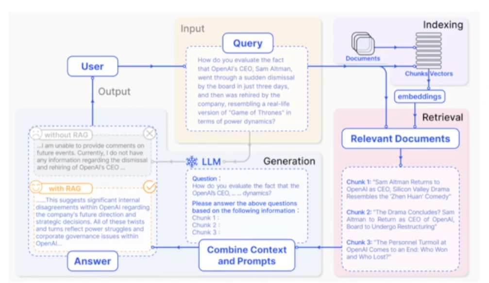
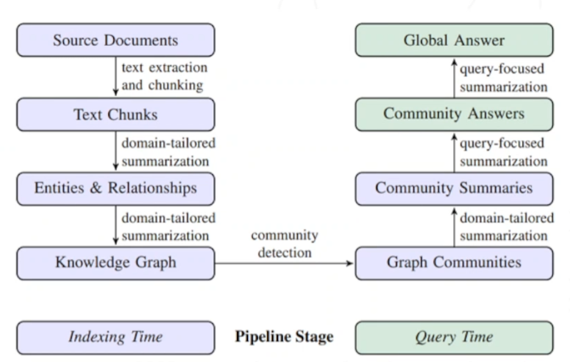

## 1.RAG基础知识认知

可以按索引形态划分(企业相对成熟的落地方案)

以语义分块+向量检索为核心 Naive RAG/ Advanced RAG(Naive rag [https://arxiv.org/abs/2312.10997](https://arxiv.org/abs/2312.10997))

抽取实体/关系构图+全局/社区检索 GraphRAG(graph rag [https://arxiv.org/abs/2404.16130](https://arxiv.org/abs/2404.16130))

## 2.

## References

1.Naive rag [https://arxiv.org/abs/2312.10997](https://arxiv.org/abs/2312.10997)

2.graph rag [https://arxiv.org/abs/2404.16130](https://arxiv.org/abs/2404.16130)
